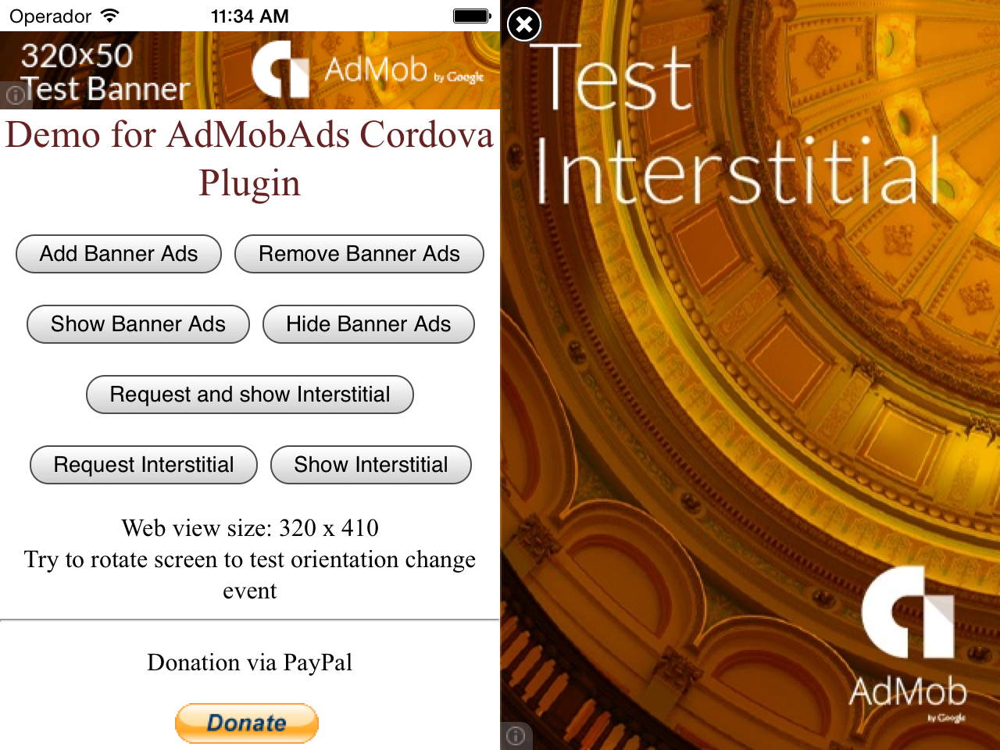
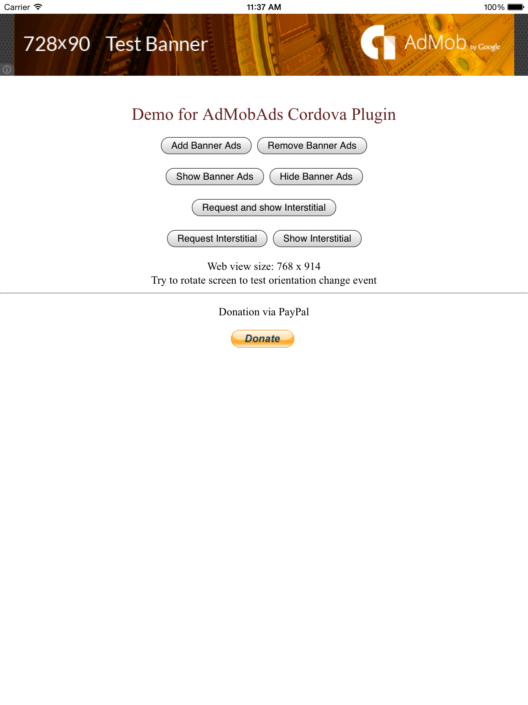
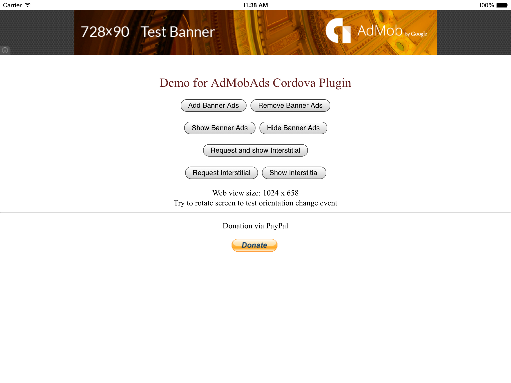

admob-google-cordova
====================

Monetize your apps with AdMob ads for Cordova Android/iOS.
With this Cordova AdMob plugin you can show AdMob ads as easy as:

    admob.createBannerView({publisherId: "ca-app-pub-xxx/7078073011"});

Or

    admob.requestInterstitialAd({interstitialAdId: "ca-app-pub-xxx/7078073011", autoShowInterstitial: true});


## Platform SDK supported ##

* iOS, using AdMob SDK for iOS, v6.11.1
* Android, using Google Play Service for Android, v4.4


## How to use ##
To install this plugin, follow the [Command-line Interface Guide](http://cordova.apache.org/docs/en/edge/guide_cli_index.md.html#The%20Command-line%20Interface).

    cordova plugin add com.admob.google
    
Or,

    cordova plugin add https://github.com/appfeel/admob-google-cordova.git

In your onDeviceReady callback:
```javascript
    
    function onDeviceReady() {
      document.removeEventListener('deviceready', onDeviceReady, false);
      admob.createBannerView({ 'publisherId' : 'ca-app-pub-xxx/7078073011' });
    }
    
    document.addEventListener("deviceready", onDeviceReady, false);
```
Note: ensure you have a proper [AdMob](https://apps.admob.com/admob/signup) account and create an Id for your app.


## Quick example with cordova CLI ##
```c
    cordova create <project_folder> com.<company_name>.<app_name> <AppName>
    cd <project_folder>
    cordova platform add android
    cordova platform add ios

    // cordova will handle dependency automatically
    cordova plugin add com.admob.google

    // now remove the default www content, copy the demo html file to www
    rm -rf www/*;
    cp plugins/com.admob.google/test/* www/

    cordova prepare; cordova run android; cordova run ios;
    // or import into Xcode / eclipse
```

## Javascript API ##
APIs:
```javascript
setOptions(options, success, fail);

createBannerView(options, success, fail);
showAd(true/false, success, fail); 
destroyBannerView();

requestInterstitialAd(options, success, fail);
showInterstitialAd();
```

## Complete example code ##
Call the following code inside onDeviceReady(), because only after device ready you will have the plugin working.
```javascript

    function initAds() {
      if (admob) {
        var adPublisherIds = {
          ios : {
            banner: 'ca-app-pub-xxx/7078073011',
            interstitial: 'ca-app-pub-xxx/8554806210'
          },
          android : {
            banner: 'ca-app-pub-xxx/4806197152',
            interstitial: 'ca-app-pub-xxx/9791193812'
          }
        };
    	  
        var admobid = (/(android)/i.test(navigator.userAgent)) ? adPublisherIds.android : adPublisherIds.ios;
            
        admob.setOptions({
          publisherId: admobid.banner,
          interstitialAdId: admobid.interstitial,
          bannerAtTop: false, // set to true, to put banner at top
          overlap: false, // set to true, to allow banner overlap webview
          offsetTopBar: false, // set to true to avoid ios7 status bar overlap
          isTesting: false, // receiving test ads (do not test with real ads as your account will be banned)
          autoShowBanner: true, // auto show banners ad when loaded
          autoShowInterstitial: true // auto show interstitials ad when loaded
        });

        registerAdEvents();
        
      } else {
        alert('AdMobAds plugin not ready');
      }
    }
    
    function onAdLoaded(e) {
      if (e.adType === admob.AD_TYPE.INTERSTITIAL) {
        admob.showInterstitialAd();
        showNextInterstitial = setTimeout(function() {
          admob.requestInterstitialAd();
        }, 2 * 60 * 1000); // 2 minutes
      }
    }
    
    // optional, in case respond to events
    function registerAdEvents() {
      document.addEventListener(admob.events.onAdLoaded, onAdLoaded);
      document.addEventListener(admob.events.onAdFailedToLoad, function (e) {});
      document.addEventListener(admob.events.onAdOpened, function (e) {});
      document.addEventListener(admob.events.onAdClosed, function (e) {});
      document.addEventListener(admob.events.onAdLeftApplication, function (e) {});
      document.addEventListener(admob.events.onInAppPurchaseRequested, function (e) {});
    }
        
    function onDeviceReady() {
      document.removeEventListener('deviceready', onDeviceReady, false);
      initAds();

      // display a banner at startup
      admob.createBannerView();
        
      // request an interstitial
      admob.requestInterstitialAd();
    }
    
    document.addEventListener("deviceready", onDeviceReady, false);
```

See the working example code in [demo under test folder](https://github.com/appfeel/admob-google-cordova/tree/master/test/index.html).

## Donate ##
You can use this cordova plugin for free. To support this project, donation is welcome.  
Donation can be accepted in either of following ways:
* Share 2% Ad traffic. (It's not mandatory. If you are unwilling to share, please fork and remove the donation code.)
+ Donate via [paypal](https://www.paypal.com/cgi-bin/webscr?cmd=_donations&business=MFQHUTN8U9XD6&lc=ES&item_name=AppFeel&item_number=com%2eadmob%2egoogle&amount=10%2e00&currency_code=EUR&bn=PP%2dDonationsBF%3abtn_donateCC_LG%2egif%3aNonHosted)


## Credits ##
[floatinghotpot/cordova-plugin-admob](https://github.com/floatinghotpot/cordova-plugin-admob.git)

[aliokan/cordova-plugin-admob](https://github.com/aliokan/cordova-plugin-admob)

## Screenshots ##
iPhone:



iPad Banner Portrait:



iPad Banner Landscape:

